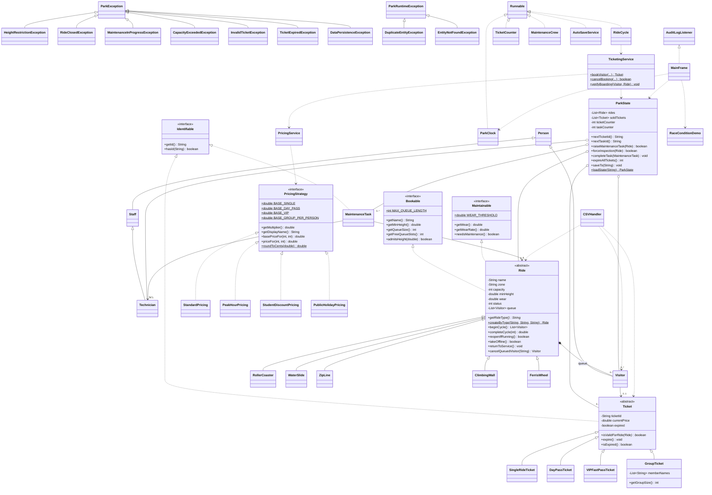

# ThrillPoint Adventure Park Management System

A desktop Ticketing & Maintenance Management System in Java using Swing, serialization + CSV storage, and custom multithreading.

This project solves the direct conflict between two operational departments:

* **Ticketing** wants rides open and full to maximize revenue.
* **Maintenance** wants rides closed to repair wear and maintain safety.

Both departments act on the same ride objects concurrently.

---

## 🚀 How to Run

The GUI is **JavaFX**, which is no longer bundled with the JDK. Pick whichever of these matches your machine.

### Option A — a JDK with JavaFX included (recommended)

Install **Liberica Full JDK 17+** or **Azul Zulu FX 17+**. JavaFX is then on the classpath and the build is a single command:

```bash
mkdir -p bin
javac -d bin src/*.java
java -cp bin Main
```

### Option B — a plain JDK plus the OpenJFX SDK

Download the OpenJFX SDK from openjfx.io and point the module path at it:

```bash
# macOS / Linux
export FX=/path/to/javafx-sdk-21/lib
mkdir -p bin
javac --module-path $FX --add-modules javafx.controls -d bin src/*.java
java  --module-path $FX --add-modules javafx.controls -cp bin Main
```

```bat
REM Windows
set FX=C:\javafx-sdk-21\lib
mkdir bin
javac --module-path %FX% --add-modules javafx.controls -d bin src\*.java
java  --module-path %FX% --add-modules javafx.controls -cp bin Main
```

### Race-condition demo on its own (FR-18)

No JavaFX needed — it is plain console output:

```bash
java -cp bin RaceConditionDemo
```

---

## 🛠️ Project Constraints & Architecture

To align strictly with the course scope:

* **No Java Enums** — replaced by type-safe `public static final` constants.
* **No Streams API** — all iteration uses `for` / for-each loops.
* **No `java.time`** — milliseconds via `System.currentTimeMillis()` and `SimpleDateFormat`.
* **No `java.util.concurrent`** — no thread pools, no atomics, no blocking queues, no explicit locks. Mutual exclusion is the `synchronized` keyword only.
* **No `wait()` / `notify()` / `volatile`** — background threads poll with `Thread.sleep()`.
* **No external libraries or build tools** — plain `javac`, no Maven or Gradle. JavaFX is the one dependency, and the project description permits it explicitly ("GUI using JavaFX or Swing").

### Live threads

| Count | Thread | Job |
|---|---|---|
| 1 | `ParkClock` | Ticks simulated time, rotates the pricing period, closes the park each day |
| 7 | `RideCycle` | One per ride: loads the queue, runs cycles, accumulates wear |
| 3 | `TicketCounter` | Simulates concurrent walk-up ticket sales |
| 2 | `MaintenanceCrew` | Claims tasks from the shared queue and assigns technicians |
| 1 | `AutoSaveService` | Serializes state + rewrites the CSVs every 10 seconds |

Plus one daemon `AuditLogger-Writer` thread that flushes the audit log off the simulation threads.

---

## 🔒 Concurrency Design

### Lock ordering — the deadlock rule

There are four monitors in the system. Every thread acquires them in **this order and no other**:

```
Ride  →  ParkState  →  { Ticket, MaintenanceTask, Technician }
```

This is why `ParkState.raiseMaintenanceTask()`, `forceInspection()` and `completeTask()` are **not** declared `synchronized`. Each one opens the *ride* monitor first and only then `synchronized (this)`. Declaring them `synchronized` would make them take `ParkState` before `Ride`, which is the exact opposite of what `TicketingService.bookVisitor()` does — and two threads taking two locks in opposite orders is a deadlock.

### Short critical sections

No lock is ever held across a `Thread.sleep()`. A ride cycle is split into three parts:

1. `Ride.beginCycle()` — claims riders and flips the status to `RUNNING` (locked, microseconds)
2. the 4-second cycle — **no lock held**
3. `Ride.completeCycle()` + `reopenIfRunning()` — books the results (locked, microseconds)

`reopenIfRunning()` only reopens a ride that is still `RUNNING`, so a forced inspection raised mid-cycle is never silently overwritten.

### Identifier generation

Ticket and task IDs come from `ParkState.nextTicketId()` / `nextTaskId()`, which are `synchronized` on `ParkState` and increment a dedicated counter. IDs are never derived from `list.size()` — three counter threads holding three different *ride* locks would all read the same size and mint the same ID.

### Consistent snapshots

`ParkState.saveTo()` is a `synchronized` **instance** method, so the object graph cannot be serialized while another thread is midway through mutating a list.

---

## 📐 Design Patterns & SOLID

| Principle / pattern | Where |
|---|---|
| **Strategy** | `PricingStrategy` interface + `StandardPricing`, `PeakHourPricing`, `StudentDiscountPricing`, `PublicHolidayPricing`; resolved by `PricingService` |
| **Observer** | `AuditLogger.AuditLogListener`, implemented anonymously by `MainFrame` |
| **Singleton** | `AuditLogger.getInstance()` |
| **Static factory** | `Ride.createByType()` — rebuilds the right subclass from a persisted type token |
| **OCP** | A new pricing period is one new class + one array entry; no existing class is edited |
| **ISP** | `Bookable` (ticketing's view of a ride) and `Maintainable` (maintenance's view) are separate role interfaces |
| **LSP** | Expiry is checked once in `TicketingService.verifyBoarding()`, not re-implemented per ticket subclass |
| **SRP** | Pricing, persistence, ticketing, and presentation are separate types |

---

## ⚠️ Exception Handling

Business rules are **thrown, not returned as strings**.

```
Exception
└── ParkException                     (checked — caller can recover)
    ├── HeightRestrictionException    (+ actualHeight, requiredHeight)
    ├── RideClosedException
    ├── MaintenanceInProgressException
    ├── CapacityExceededException     (+ requested, available)
    ├── InvalidTicketException
    ├── TicketExpiredException        (+ ticketId)
    └── DataPersistenceException      (wraps IOException, preserves getCause())

RuntimeException
└── ParkRuntimeException              (unchecked — broken invariant)
    ├── DuplicateEntityException
    └── EntityNotFoundException
```

`MainFrame.handleBooking()` catches these specific-to-general and maps each to its own dialog. `DataPersistenceException` demonstrates exception translation with the cause preserved.

---

## 💾 File Handling

Two mechanisms, two jobs:

| Mechanism | Files | Purpose |
|---|---|---|
| CSV text | `rides.csv`, `tickets.csv`, `visitors.csv` | Human-readable master data, editable outside the app |
| Serialization | `park_state.ser` | Complete object-graph snapshot including queues |
| Plain text | `audit_log.txt`, `park_reports.txt` | Append-only audit trail and exported reports |

Startup falls back in three tiers: snapshot → CSV → hardcoded defaults.

**`rides.csv` stores an explicit `RideType` column.** The subclass is never inferred from the ride's name — renaming "Aqua Drop" would otherwise reload it as a `FerrisWheel` with the wrong capacity, height limit and wear rate. A legacy loader still reads old headerless-type files once, with a warning.

Malformed rows are logged and skipped, never fatal. All file I/O uses try-with-resources.

---

## 🖥️ GUI Tabs

1. **Ticketing Counter** — book a visitor, live price preview that follows the active pricing period. Group members are entered as `Ali:1.55; Sara:1.40; Bilal`, and each height is checked against the ride individually
2. **Rides Monitor** — live table with wear bars, uptime %, load factor and downtime. **Cancel a Booking** (FR-05), **Close** / **Reopen** a ride by management decision (FR-09)
3. **Visitors & Tickets** — search by name or ticket ID; select a holder and **board them again on their existing ticket, free of charge**. This is what makes a Day Pass and a VIP Fast Pass mean anything
4. **Maintenance Operations** — task queue, technician roster with per-technician workload, safety log, **Force Inspection**
5. **Analytics Reports** — revenue by ride, riders and uptime by zone, a daily history table, file export, **Run Race Condition Demo** (FR-18)
6. **Live Log Feed** — colour-coded real-time audit stream

The header carries **Pause / Resume** and a **speed dial** (0.5×–8×). Both are read by every worker thread through `SimulationControl`, which chops each wait into 100 ms slices so a change takes effect immediately rather than at the end of a multi-second sleep.

## 📈 Management Reporting

- **Per ride** — riders carried, revenue, cycles run, **load factor** (riders as a share of seats offered) and **uptime %** with total downtime
- **Per zone** — rides open, riders, revenue, average uptime, current queue depth
- **Per day** — `ParkClock` files a `DayRecord` at each park close holding that day's revenue, riders, tickets and repairs as a delta against the previous close, so a trend is visible rather than one ever-growing total
- **Per technician** — repairs completed, time on the job, average repair time. Makes it obvious when the Senior certification is the bottleneck, since only Seniors may touch a roller coaster

---

## 📊 UML Class Diagram



---

## 📁 Source Layout

`src/` — 48 files, all in the default package so the build stays a single `javac -d bin src/*.java`.

| Group | Types |
|---|---|
| UI shell | `ParkApplication`, `MainWindow`, `ParkPanel`, `Theme`, `Dialogs` |
| UI tabs | `TicketingPanel`, `RideStatusPanel`, `VisitorPanel`, `MaintenancePanel`, `ReportPanel`, `EventLogPanel` |
| People | `Person`, `Visitor`, `Staff`, `Technician` |
| Rides | `Ride`, `RollerCoaster`, `WaterSlide`, `ZipLine`, `ClimbingWall`, `FerrisWheel` |
| Tickets | `Ticket`, `SingleRideTicket`, `DayPassTicket`, `VIPFastPassTicket`, `GroupTicket` |
| Contracts | `Identifiable`, `Bookable`, `Maintainable`, `PricingStrategy` |
| Pricing | `PricingService`, `StandardPricing`, `PeakHourPricing`, `StudentDiscountPricing`, `PublicHolidayPricing` |
| Park | `ParkState`, `MaintenanceTask` |
| Services | `TicketingService`, `CSVHandler`, `AuditLogger` |
| Threads | `ParkClock`, `RideCycle`, `TicketCounter`, `MaintenanceCrew`, `AutoSaveService`, `RaceConditionDemo` |
| Exceptions | `ParkException` + 7 subclasses, `ParkRuntimeException` + 2 subclasses |
| UI | `MainFrame` |
| Entry | `Main` |
